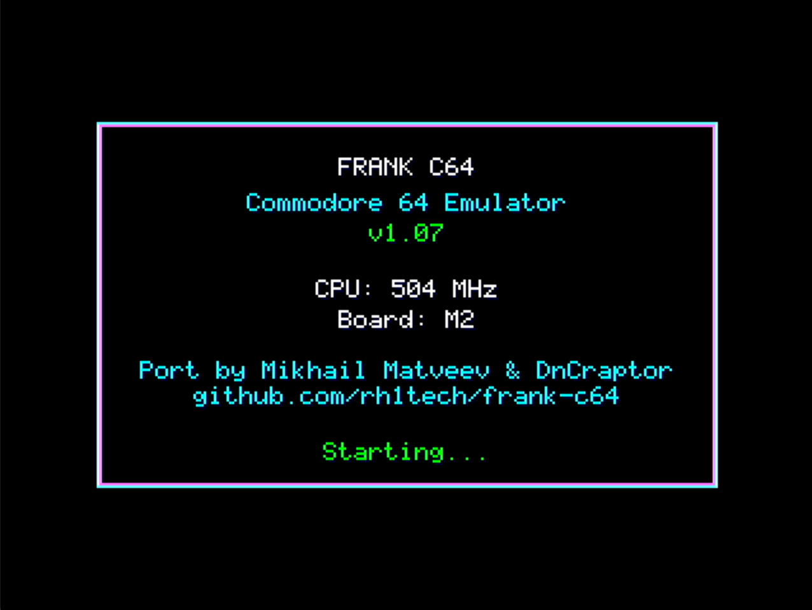
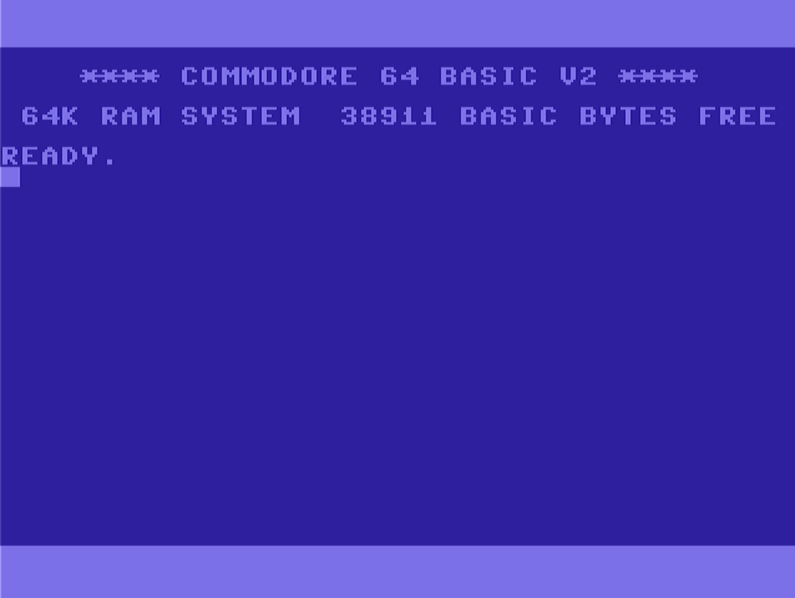
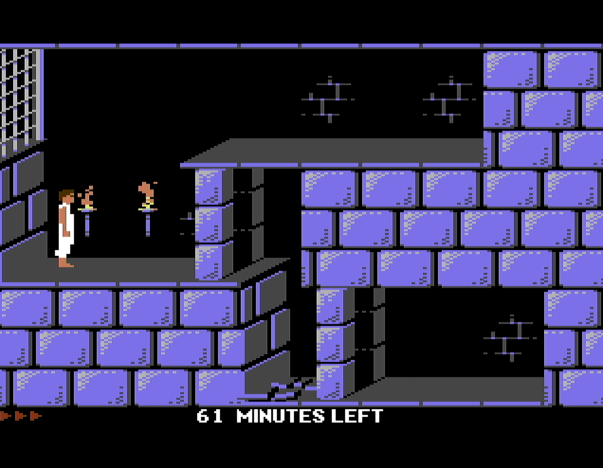
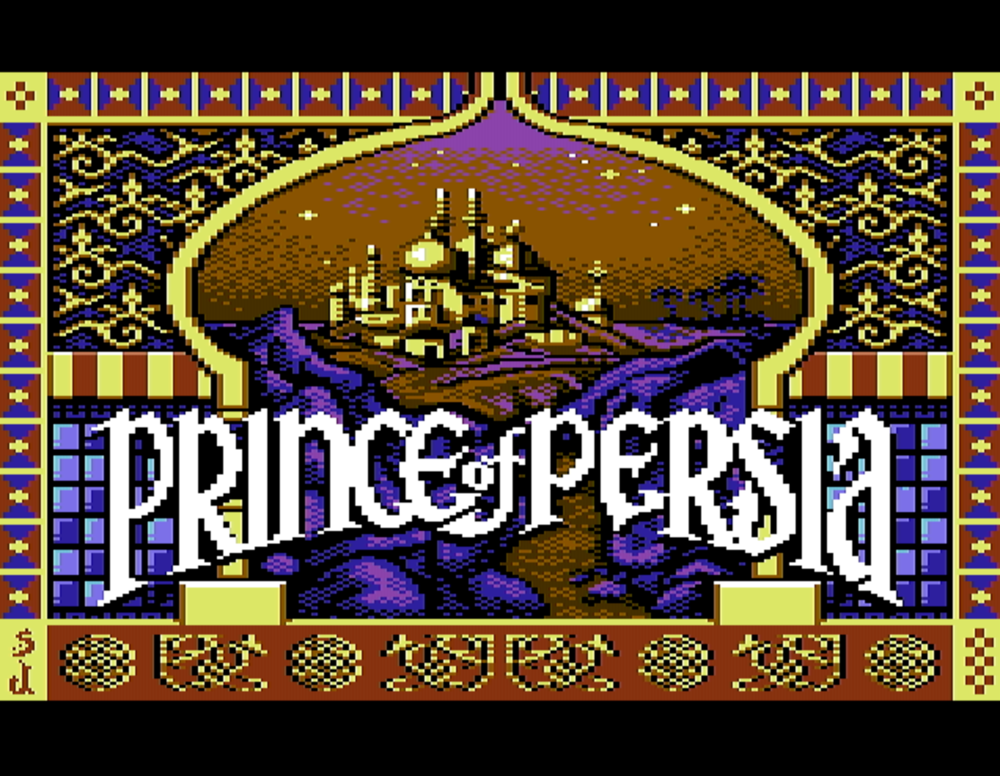

# FRANK C64

Commodore 64 emulator for Raspberry Pi Pico 2 (RP2350) with HDMI/VGA output, SD card, and PS/2 keyboard.

Based on [Frodo4](https://frodo.cebix.net/) by Christian Bauer — a portable Commodore 64 emulator.

## Supported Boards

This firmware is designed for the following RP2350-based boards with integrated HDMI, SD card, PS/2, and PSRAM:

- **[Murmulator](https://murmulator.ru)** — A compact retro-computing platform based on RP Pico 2, designed for emulators and classic games.
- **[FRANK](https://rh1.tech/projects/frank?area=about)** — A versatile development board based on RP Pico 2, HDMI output, and extensive I/O options.

Both boards provide all necessary peripherals out of the box—no additional wiring required.

## Features

- Full Commodore 64 PAL emulation (50 Hz)
- **HDMI video output** — Native 640x480 (320x240) via PIO
- **VGA video output** — Native 640x480 (320x240) via PIO (active accent color resistor DAC)
- 8MB QSPI PSRAM support for C64 RAM and disk images
- SD card support for D64/D81 disk images
- PS/2 and USB keyboard input
- NES/SNES gamepad support (directly and via USB)
- **I2S audio output** — High-quality SID emulation via external DAC
- **PWM audio output** — SID emulation without external DAC (directly via GPIO)
- Multiple CPU speed options: 378, 428 (VGA only), 504 MHz

## Screenshots

### Startup Screen
Emulator boot screen showing system information and initialization status.



### Commodore 64 BASIC
Classic Commodore 64 BASIC interpreter ready for input.



### Game: The Last Ninja
Demonstrating full game compatibility with smooth C64 emulation.



### Game: Prince of Persia
Another classic title running at native C64 resolution and colors.



## Hardware Requirements

- **Raspberry Pi Pico 2** (RP2350) or compatible board
- **8MB QSPI PSRAM** (mandatory!)
- **Video output** (choose one):
  - **HDMI connector** — directly connected via 270Ω resistors (no encoder needed)
  - **VGA connector** — accent color resistor DAC
- **SD card module** (SPI mode)
- **PS/2 or USB keyboard**
- **Audio output** (choose one):
  - **I2S DAC module** (e.g., TDA1387) — recommended for high-quality audio
  - **PWM audio** — no external DAC needed, directly via GPIO pins

### PSRAM Options

FRANK C64 requires 8MB PSRAM to run. You can obtain PSRAM-equipped hardware in several ways:

1. **Solder a PSRAM chip** on top of the Flash chip on a Pico 2 clone (SOP-8 flash chips are only available on clones, not the original Pico 2)
2. **Build a [Nyx 2](https://rh1.tech/projects/nyx?area=nyx2)** — a DIY RP2350 board with integrated PSRAM
3. **Purchase a [Pimoroni Pico Plus 2](https://shop.pimoroni.com/products/pimoroni-pico-plus-2?variant=42092668289107)** — a ready-made Pico 2 with 8MB PSRAM

## Board Configurations

Two GPIO layouts are supported: **M1** and **M2**. The PSRAM pin is auto-detected based on chip package:
- **RP2350B**: GPIO47 (both M1 and M2)
- **RP2350A**: GPIO19 (M1) or GPIO8 (M2)

### HDMI (via 270Ω resistors)
| Signal | M1 GPIO | M2 GPIO |
|--------|---------|---------|
| CLK-   | 6       | 12      |
| CLK+   | 7       | 13      |
| D0-    | 8       | 14      |
| D0+    | 9       | 15      |
| D1-    | 10      | 16      |
| D1+    | 11      | 17      |
| D2-    | 12      | 18      |
| D2+    | 13      | 19      |

### VGA (accent color resistor DAC)
VGA uses the same base pins as HDMI. See Murmulator hardware documentation for resistor DAC wiring.

### SD Card (SPI mode)
| Signal  | M1 GPIO | M2 GPIO |
|---------|---------|---------|
| CLK     | 2       | 6       |
| CMD     | 3       | 7       |
| DAT0    | 4       | 4       |
| DAT3/CS | 5       | 5       |

### PS/2 Keyboard
| Signal | M1 GPIO | M2 GPIO |
|--------|---------|---------|
| CLK    | 0       | 2       |
| DATA   | 1       | 3       |

### NES/SNES Gamepad
| Signal | M1 GPIO | M2 GPIO |
|--------|---------|---------|
| CLK    | 14      | 20      |
| LATCH  | 15      | 21      |
| DATA   | 16      | 22      |

### I2S Audio
| Signal | M1 GPIO | M2 GPIO |
|--------|---------|---------|
| DATA   | 26      | 9       |
| BCLK   | 27      | 10      |
| LRCLK  | 28      | 11      |

### PWM Audio
| Signal | M1 GPIO | M2 GPIO |
|--------|---------|---------|
| RIGHT  | 26      | 10      |
| LEFT   | 27      | 11      |

## Building

### Prerequisites

1. Install the [Raspberry Pi Pico SDK](https://github.com/raspberrypi/pico-sdk) (version 2.0+)
2. Set environment variable: `export PICO_SDK_PATH=/path/to/pico-sdk`
3. Install ARM GCC toolchain

### Build Steps

```bash
# Clone the repository with submodules
git clone --recursive https://github.com/rh1tech/frank-c64.git
cd frank-c64

# Or if already cloned, initialize submodules
git submodule update --init --recursive

# Build using the build script (development build with USB serial debug)
./build.sh

# Or build manually with CMake
mkdir build && cd build
cmake -DPICO_PLATFORM=rp2350 \
      -DBOARD_VARIANT=M1 \
      -DVIDEO_TYPE=VGA \
      -DAUDIO_TYPE=PWM \
      -DCPU_SPEED=378 ..
make -j$(nproc)
```

### Release Builds

To build all firmware variants with version numbering and USB HID enabled:

```bash
./release.sh
```

This creates versioned firmware archives in the `release/` directory:

- `frank-c64_m1_X_XX.zip` — All M1 board variants
- `frank-c64_m2_X_XX.zip` — All M2 board variants

Each archive contains firmware for all combinations:
- **Video**: VGA, HDMI
- **Audio**: I2S, PWM
- **CPU Speed**: 378, 428 (VGA only), 504 MHz

Filename format: `frank-c64_mX_video_audio_speedmhz_version.uf2`

Example: `frank-c64_m1_vga_pwm_378mhz_1_02.uf2`

### Flashing

```bash
# With device in BOOTSEL mode:
picotool load build/frank-c64.uf2

# Or with device running:
picotool load -f build/frank-c64.uf2

# Or use the flash script:
./flash.sh
```

## SD Card Setup

1. Format an SD card as FAT32
2. Create a `c64` folder in the root
3. Copy your D64 or D81 disk images to the `c64` folder

## Keyboard Mapping

The keyboard layout uses VICE-style positional mapping:

```
PC:  ` 1 2 3 4 5 6 7 8 9 0 - =
C64: <- 1 2 3 4 5 6 7 8 9 0 + -

PC:  Q W E R T Y U I O P [ ]
C64: Q W E R T Y U I O P @ *

PC:  A S D F G H J K L ; '
C64: A S D F G H J K L : ;

PC:  Z X C V B N M , . /
C64: Z X C V B N M , . /
```

### Special Keys

| PC Key      | C64 Key        |
|-------------|----------------|
| Esc         | RUN/STOP       |
| Backspace   | INS/DEL        |
| Return      | RETURN         |
| Shift       | SHIFT          |
| Caps Lock   | SHIFT LOCK     |
| Tab         | CTRL           |
| L-Ctrl      | CTRL           |
| L-Alt       | C= (Commodore) |
| \           | ^ (up arrow)   |
| Home        | CLR/HOME       |
| End         | £ (pound)      |

### Function Keys and System Hotkeys

| PC Key        | Function           |
|---------------|--------------------|
| F1-F8         | C64 F1-F8          |
| F9            | Swap joystick port |
| F10           | Disk selector UI   |
| F11           | RESTORE (NMI)      |
| Ctrl+Alt+Del  | Reset C64          |

### Joystick Emulation

Arrow keys can be used for joystick control (active on port 2 by default):

| Key           | Joystick Action |
|---------------|-----------------|
| Arrow Up      | Up              |
| Arrow Down    | Down            |
| Arrow Left    | Left            |
| Arrow Right   | Right           |
| R-Ctrl        | Fire            |
| R-Alt         | Fire            |

Press **F9** to swap between joystick port 1 and port 2.

## License

GNU General Public License v2 or later. See [LICENSE](LICENSE) for details.

This project is based on:
- [Frodo4](https://frodo.cebix.net/) by Christian Bauer — Portable Commodore 64 emulator

## Authors

- Mikhail Matveev <<xtreme@rh1.tech>>
- [DnCraptor](https://github.com/dncraptor/) — VGA driver, PWM audio, build system improvements

## Acknowledgments

- Christian Bauer for the original Frodo C64 emulator
- The [VICE](https://vice-emu.sourceforge.io/) team for VIC-II implementation reference
- [xrip](https://github.com/xrip) and [DnCraptor](https://github.com/dncraptor/) for drivers and code contributions
- The [Murmulator community](https://murmulator.ru) for hardware designs and software support
- The Raspberry Pi foundation for the RP2350 and Pico SDK
- The Commodore 64 community for preserving this classic platform
